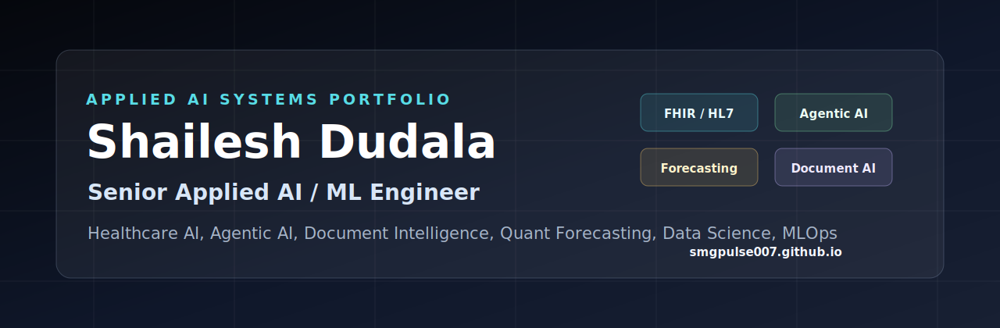

# Shailesh Dudala

**Senior Applied AI / Agentic AI Engineer**

Production AI systems for healthcare, insurance, claims automation, document intelligence, FHIR/HL7 interoperability, and LLMOps.

[Portfolio](https://smgpulse007.github.io/) | [LinkedIn](https://www.linkedin.com/in/ssdudala/) | [GitHub](https://github.com/smgpulse007)

## Impact

| 7K-case backlog cleared | 90% review-time reduction | $3M client P4P impact |
|---|---|---|
| Healthcare operations delivery | Claims/document review acceleration | Value-based care and quality programs |

Selected outcomes from prior healthcare and insurance AI delivery. Public repositories use synthetic/sanitized data only.

## Featured Systems

| Project | Focus |
|---|---|
| [Hospital Readmission FHIR ML API](https://github.com/smgpulse007/hospital-readmission-fhir-ml-api) | Synthetic FHIR ingestion, readmission scoring, explainability, FastAPI, Docker, tests |
| [HL7 AI Challenge Platform](https://github.com/smgpulse007/hl7-ai-challenge) | HL7/FHIR event-driven quality intelligence, SMART/CDS patterns, RabbitMQ, Docker |
| [LLM Steering Lab](https://github.com/smgpulse007/llm-steering) | Local-first activation steering, representation engineering, FastAPI workbench, React UI |
| [Local Document AI Extraction](https://github.com/smgpulse007/ollama_poc) | Local PDF extraction, Ollama, LangChain, Streamlit, privacy-preserving workflows |
| [Agentic Alpha Engine](https://github.com/smgpulse007/AlphaQuant) | Agent orchestration, stateful workflows, retrieval/storage architecture, local-first stack |
| [FreshTrack AI Module](https://github.com/smgpulse007/FreshTrackAIModule) | OCR + LLM parsing API, structured JSON outputs, confidence scoring, Docker deployment |

## Skill Map

**Agentic AI:** LangGraph, LangChain, tool/function calling, workflow state, typed validation, exception routing

**Healthcare / Insurance AI:** FHIR R4, HL7 ADT/ORU/MDM, HEDIS, claims automation, readmission, LOS, ED utilization, FWA analytics

**Document AI:** OCR, PDF parsing, RAG, structured extraction, confidence gates, local/private inference

**MLOps / LLMOps:** Docker, Kubernetes, MLflow, CI/CD, observability, token/cost telemetry, regression testing

## Safety Note

All public examples are synthetic, sanitized, or research/demo implementations. No PHI, PII, employer-confidential data, proprietary claims data, or production credentials are included.
